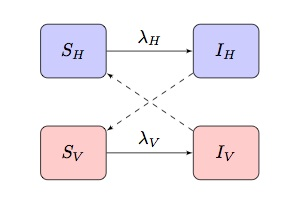

Zika is Coming and We need Statistics
========================================================
author:  Abby Smith, Elaine Liu, Sam Ventura
date: August 2, 2017
autosize: true


Roadmap
========================================================
incremental:true
1. History
2. Compartment Models and $R_{0}$
    + Standard SIR (Susceptible, Infected, Recovered)
    + Extensions to Vector-Borne Diseases
3. Agent-Based Models (ABMs)
      + Advantages of ABMs over Compartment Models
4. Generating Input (Synthetic Population) for an ABM, focusing on vectors
      + Using Maxent Model for species presence 
      + Generating a population for any vector, anytime, anywhere


    
Some History
========================================================
right: 60%
 
***
<small>
* 1883: Ronald Ross hypothesized connection between mosquitoes and malaria 
* Ross showed using a mathematical model that it was not necessary to remove every mosquito to bring the disease under control
* Led way to concept of "herd immunity"
   + Vaccinate a sufficient proportion of the population, the disease will not turn into an epidemic
   
</small>


Looking Ahead, Not Back
========================================================

<font size=5.75>
* McKendrick and Kermack (1920) extended Ross's work to group healthy and infected into **compartments**
* Most common compartment model: **SIR**
    + Start out susceptible to infections (**S**)
    + Upon exposure, they would move into the infectious group (**I**)
    + Leave infectious group. Either die or recover by gaining immunity (**R**)
* Basic way to study disease dynamics

</font>

***
<center>


The Remarkable \(R_{0}\): What causes an epidemic to end?
========================================================

<font size = 5.2>
* $R_{0}$ (basic reproduction number): expected number of secondary cases produced by a single (typical) infection in a completely susceptible population
* $R_{0}< 1$ : infection will die out, > 1 : infection will persist
* Has also helped predict the severity of new threats such as the SARS outbreak in 2003
* During the peak of the most recent Zika outbreak, the $R_{0} \approx 2$

</font>

<center>


Compartment Models of Vector-Borne Disease
========================================================

<center>

*** 
<font size=5.8>
## Key Assumptions:
* Number of humans and mosquitoes are constant
* No acquired immunity
* Populations sizes are large, well-mixed
* Deterministic 

## Complications
* Stochasticity
* Mosquito behavior and biology
* Details of infections

</font>

Introduction to Agent-Based Models (ABMs)
========================================================
<font size = 5.7> 
* Powerful simulation modeling technique that has become popular over the years
* Collection of autonomous decision-making entities called agents
   + Going to school, going to work, and socializing 
* Can even demonstrate results of adaptive behavior
* Agents can be generated as part of a synthetic population: input to the ABM
    + Generated from real-world data
    
</font>

***

<center>


Advantages of an Agent-Based Model
========================================================
### *What can ABMs do better than compartment models?*
* Adaptive Behavior: adjust their behavior to current state
* Emergence: system dynamics that arise because of agent actions and interactions
    + <small> ABMs are across-level: we can look at both what happens to the *system* because of what *individuals* do, and what happens to *individuals* because of what the *system* does </small>
    </font>
* Flexible
* Complex

What is a synthetic population for an ABM of a disease?
========================================================
right: 70%
<center>

*** 
<font size = 5.9>
* **Agents** - a set of indiviudals that interact with one another
* **Characteristics** - features of the agents (e.g., species, age, sex, race, type, etc.)
* **Locations** - where the agents are located
* **Environmental components** - loci of interaction of the agents (e.g., hospitals, schools, workplaces, fields, etc.)
* **Activities** - how the agents interact with one another and evolve over time
* **'Synthetic'** - created from data through statistical procedures
  + American Community Survey (U.S. Census)
  + American Time Use Survey
  
</font>


Goal: Vectors as Agents
========================================================
right: 65%

<span style="font-weight:bold; "> Ticks, Rats, Mosquitoes, Oh My! </span>
<br>
<font size = 4.5>
Vectors are important in infectious disease modelling, especially for diseases such as malaria or Zika.
</font> </span> 

<span style="font-weight:bold; "> Goal </span>
<br>
<font size = 4.5>
Generate synthetic population of infectious disease vectors to complement CMU's synthetic ecosystem (SPEW) that could be used as input to an ABM of a vector-borne disease. Be able to generate for <span style="font-weight:bold; color:red ;"> any species, 
any time of year, any where in the world. </font> </span> 
 

***
<center>

Maximum Entropy Model (Elith 2011)
========================================================
<font size = 5.8>

* Input Data
    + **Species Presence Data**: geographical locations of observed species
    + **Environment Factors**: a set of global climate layers (gridded climate data [precipitation, temperature, etc.]) from WorldClim
* Output Data: two types of probability grid cell outputs
    + Raw Probability: proportion of potential distribution each site represents
    + Logistic Probability: the probability of occurrence

</font> 

<font size = 5>
$$P_{raw} = \frac{f_1(z)}{f(z)}$$
$$P_{logit} = logistic (\frac{f_1(z)}{f(z)}) = logistic(P_{raw})$$

$$f_1(z): \text{conditional density at presence sites}$$
$$f(z): \text{marginal density across the study area}$$


</font>

Global to Local Predictions
========================================================
<font size=5.8>

* Take the name of a geographical region by a string vector


```r
c("USA")
c("USA", "Pennsylvania")
c("USA", "Pennsylvania", "Allegheny")
```

* Extract geographical boundaries from Global Administrative Areas (GADM) as spatial polygons 
* Masking the prediction grids with geographical boundaries to extract regional distribution
* Transform Raw Probability Predictions:

$$
\begin{aligned}
  P_{presence_{i} |presence_{local}} &= \frac{P_{presence_{i} \, \, \, and \, \, \, presence_{local}}}{P_{presence_{local}}} &= \frac{P_{presence_{i} \, \, \, and \, \, \, local}}{\sum_{j: Site_{j} \, \, \, in \, \, \, local} P_{presence_{i} \, \, \, and \, \, \, presence_{local}}} \\ &= \frac{P_{new \, \, \, raw}}{\sum_{j: Site_{j} \, \, \, in \, \, \, local} P_{raw_{i}}}
\end{aligned}
$$

</font>

Global to Local Predictions
========================================================


Time Dependent Predictions
========================================================


<font size= 4.5>
<div class="footer" style="margin-top:50px;">
$$\frac{\frac{1}{n_{j}} \sum_{\text{j: Site j in region}}P_{logit_{a,j}}}{\frac{1}{n_{j}} \sum_{\text{j: Site j in region}}P_{logit_{b,j}}} = \frac{\bar{P}_{logit_{a,j}}}{\bar{P}_{logit_{b,j}}}$$
</div>
</font>

***

<font size= 5.5>

* We can change environmental factors by:
  + Subsetting environment layers by month 
  + Subsetting species occurrence data by month 
  + Fitting separate models for each month


* Compare likelihood of a species' presence in different months using mean logistic probability ratios, which reflects the true probability of a species' presence

</font>

We can even look at climate change!
========================================================

<center>

****

<center>


Population Sampling 
========================================================


*** 
<font size=5.5>

* **Monthly Sample Size** : Given a specific sample size in a reference month, calculate the corresponding sample size  for other months based on logistic probabilities, which reflect true probabilities of presence

$$N_{\text{given}} = \frac{\text{Mean(logistic prob in given month)}}{\text{Mean(logistic prob in reference month)}} \, \, \times N_{\text{ref}}$$


* **Sampling Methodology**: Sampling according to transformed regional raw probabilities, which reflect relative likelihood of a presence instance coming from each grid in the region

</font>

Simulation Results: Mosquitoes in MD (N=2000 in June)
========================================================


What about Zika?
========================================================

<center>

***
<font size = 5.7>

* We now have a flexible data input that is environmentally and time dependent for *vectors* 
* Better data can give us better models
* Policy-makers can effectively use these models to predict the emergence of new diseases and see how behaviors impact the spread of Zika on a very local level


</font>

Summary
========================================================
<center>

*** 

* Although compartment models for infectious diseases are useful and have a rich history- ABMs have high computational and predictive power!!
* We can start by generating the input: synthetic populations for both people and vectors!


References
========================================================

<font size= 4>

Agent-based model - Wikipedia. (n.d.). Retrieved April 3, 2017, from https://en.wikipedia.org/wiki/Agent-based_model

Chowell, G., C. Castillo-Chavez, P.W. Fenimore, C.M. Kribs-Zaleta, L. Arriola, J.M. Hyman. 2004. Model parameters and outbreak control. Emerging Infectious Disease Journal 28 March 2016].

Day, Troy, A. Park, N. Madras, A. Gumel, J. Wu. 2006. When Is Quarantine a Useful Control Strategy for Emerging Infectious Diseases? American Journal of Epidemiology 163 (5): 479-485. doi: 10.1093/aje/kwj05.

Elith, J., Phillips, S. J., Hastie, T., Dudak, M., Chee, Y. E., & Yates, C. J. (2011). A statistical explanation of MaxEnt for ecologists. Diversity and distributions, 17(1), 43-57.

Gallagher, S., Richardson, L., Ventura, S. L., & Eddy, W. F. (2017). SPEW: Synthetic Populations and Ecosystems of the World. arXiv preprint arXiv:1701.02383.

Hurford, Amy. 2016. Ronald Ross' mosquito theorem. Just Simple Enough: The Art of Mathematical Modelling.

Kukaswadia, Atif. 2016. John Snow: The First Epidemiologist. Public Health Perspectives.


</font>
